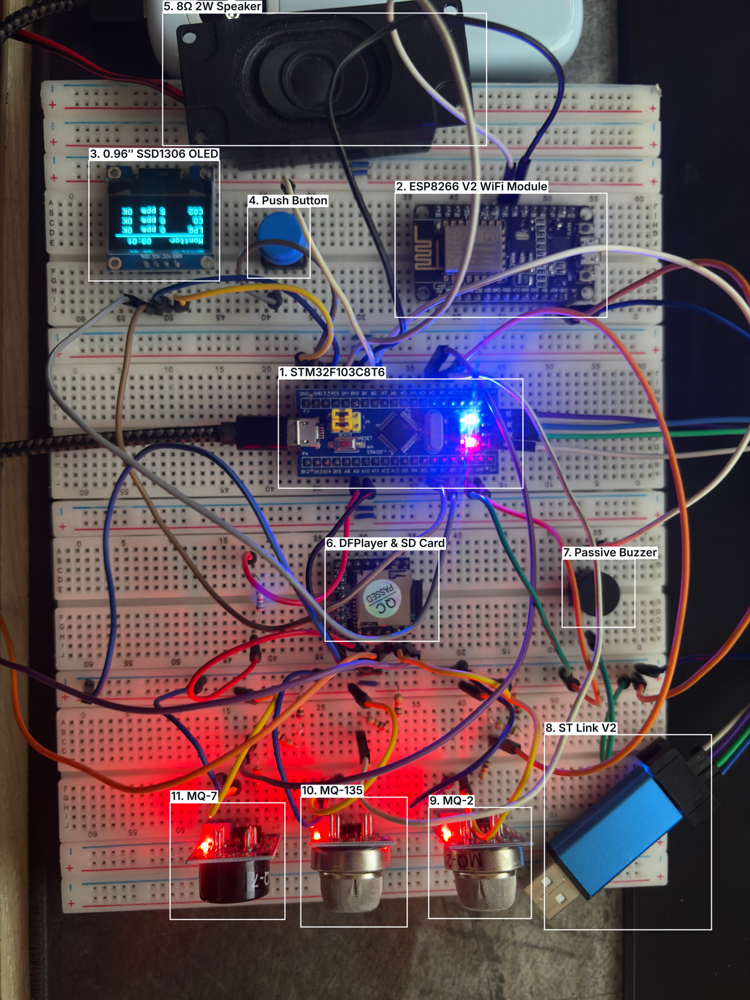
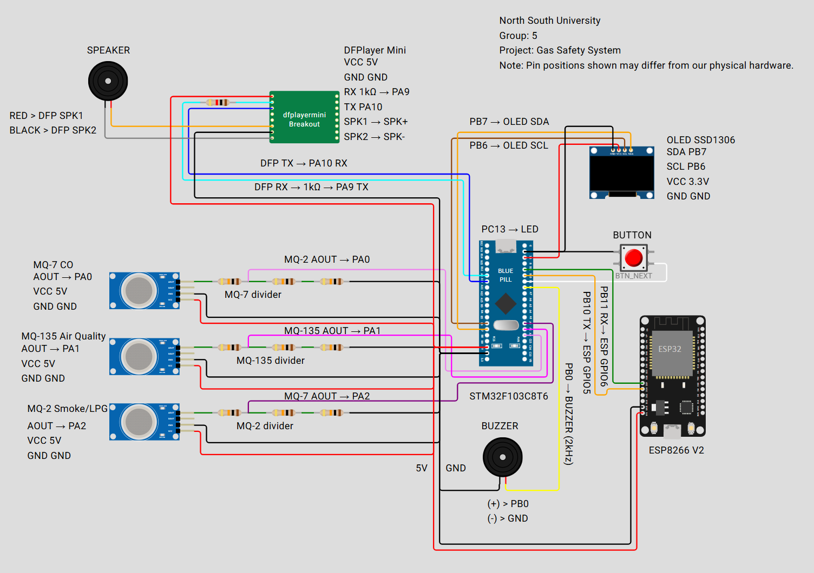

# Multi-Gas Safety System with Voice Alerts & Web Dashboard

An embedded real-time gas-safety monitor built around the **STM32F103C8T6 (Blue Pill)** microcontroller. It samples three MQ-series gas sensors (MQ-2, MQ-7, MQ-135), classifies readings into Normal / Warning / Critical tiers, and reacts through four parallel output channels: an OLED display, a passive buzzer, a DFPlayer Mini speaking pre-recorded MP3 alerts, and a self-hosted web dashboard served by an ESP8266 in Wi-Fi Access Point mode, no internet required.

> **Course:** CSE331L: Microprocessor Interfacing & Embedded Systems Lab, North South University
> 
> **Semester:** Spring 2026
>
> **Section:** 7
>
> **Group:** 5




---

## Features

- **Three-gas detection.** MQ-2 for LPG / combustibles, MQ-7 for carbon monoxide, MQ-135 for CO₂ / air quality. All three sensors share one ADC handle through software channel multiplexing.
- **Three severity tiers.** `NORMAL`, `WARNING`, `CRITICAL` — configurable per-gas cutoffs in `thresholds.h`, with debounce (2 confirmation cycles) to suppress single-sample glitches and a post-calibration grace period.
- **Multi-modal alerting.** Distinct buzzer patterns (1 Hz blip on warn, 5 Hz urgent on crit), spoken MP3 announcements only on critical events to avoid alarm fatigue, and a flashing inverted OLED overlay.
- **Five-page OLED UI.** Overview, MQ-2 detail, MQ-7 detail, MQ-135 detail, system info — cycled with a single push button on `EXTI1`.
- **Self-hosted Wi-Fi dashboard.** ESP8266 hosts an HTTP server on its own `GasSafety` access point. Phone connects, opens `192.168.4.1`, sees live ppm + severity for all three sensors, with stale-link detection.
- **Integer-only math throughout.** No floating-point on the Cortex-M3; gas curves use scaled integer interpolation.
- **Cooperative scheduler.** Sensor cycle every 500 ms, buzzer pattern update every 10 ms, no `HAL_Delay` blocking the main loop.

## Hardware

| Component | Role | Interface |
|---|---|---|
| STM32F103C8T6 (Blue Pill) | Main MCU, 72 MHz Cortex-M3 | — |
| MQ-2 | LPG / methane / smoke | ADC1_IN0 (PA0) |
| MQ-135 | CO₂ / NH₃ / air quality | ADC1_IN1 (PA1) |
| MQ-7 | Carbon monoxide | ADC1_IN2 (PA2) |
| 0.96″ SSD1306 OLED | Live display, 128×64 | I²C1 (PB6 / PB7) |
| Push button | Page navigation | EXTI1 (PB1) |
| Passive buzzer | Tonal alerts | TIM3_CH3 PWM (PB0) |
| DFPlayer Mini + 8 Ω 2 W speaker | Voice alerts from SD card | USART1 (PA9 → DFPlayer RX) |
| ESP8266 NodeMCU V2 | Wi-Fi AP + web dashboard | USART3 (PB10 → ESP D6) |
| ST-Link V2 | Programming / debug | SWD |

Each MQ module runs on 5 V; a 10 kΩ / 20 kΩ resistor divider on every analog output drops the swing to a safe 3.3 V range for the ADC. The DFPlayer Mini's RX is fed through a 1 kΩ series resistor for level-protection.

See [`assets/Project_Configuration_Guide_V5.pdf`](assets/Project_Configuration_Guide_V5.pdf) for the complete pinout and CubeMX configuration.



## Repository Layout

```
.
├── README.md                  # this file
├── LEARN.md                   # deep walkthrough of the firmware
├── assets/                    # PDF references, photos, and figures used in docs
├── firmware/                  # main, header, and source file
├── project/                   # entire code with project
└── wifi_esp8266/
    └── wifi_8266.ino          # Wi-Fi AP + HTTP dashboard
```

## Quick Start

### Prerequisites
- STM32CubeMX + Keil µVision (MDK-ARM) or STM32CubeIDE
- Arduino IDE 1.8+ with the ESP8266 board package
- ST-Link V2 programmer
- microSD card (FAT32) loaded with `0001.mp3` … `0013.mp3` per the track map in [`mp3`](mp3/)

### Build & flash the STM32

1. Open the CubeMX project (or recreate the configuration following [`assets/Project_Configuration_Guide_V5.pdf`](assets/Project_Configuration_Guide_V5.pdf)).
2. Drop the files in `firmware/` into your `Core/Src` and `Core/Inc` folders.
3. Build in Keil and flash via ST-Link.

### Flash the ESP8266

1. Open `wifi_esp8266/wifi_8266.ino` in the Arduino IDE.
2. Install dependencies: `ESP8266WiFi`, `ESP8266WebServer`, `SoftwareSerial`, `ArduinoJson`.
3. Select your NodeMCU board, compile, and upload.

### First boot

1. Power up. The OLED shows "Gas Safety Monitor — starting…" and the speaker says *"System activated."*
2. A 30-second warm-up bar ticks down. **Make sure the room air is clean during this window** — calibration uses these readings as the reference R₀ for every sensor.
3. After calibration, the speaker says *"System ready"*. Live monitoring begins.
4. On your phone, connect to the Wi-Fi network `GasSafety` (password `safety2026`) and open `http://192.168.4.1`.

## How it Behaves

| Severity | Buzzer | Voice | OLED |
|---|---|---|---|
| `NORMAL` | silent | — | live page (button-cycled) |
| `WARNING` | 1 Hz, 25% duty (polite blip) | — | focused alert: primary gas big, others summarised |
| `CRITICAL` | 5 Hz, 50% duty (urgent) | track 0004 / 0006 / 0010 + 15 s cooldown replay | full-screen flashing **DANGER / EVACUATE** overlay |
| Returning to `NORMAL` from any alert | silent | track 0011 *"all clear"* | normal page resumes |

When several gases trigger thresholds simultaneously, the highest-priority channel wins (CO > LPG > CO₂), so the speaker never overlaps two announcements.

## Documentation

- **[LEARN.md](LEARN.md)** — module-by-module deep dive: the math behind the MQ curves, why the buzzer pattern uses modular tick arithmetic, the DFPlayer command frame format, the JSON pipeline to the dashboard, and so on.
- **[assets/Project_Configuration_Guide_V5.pdf](assets/Project_Configuration_Guide_V5.pdf)** — STM32CubeMX setup, pin map, full execution flow.


## Team — Group 5

| Name | Student ID |
|---|---|
| Md Aminul Islam Labib | 2322074 |
| Tesha Akter | 2131526 |
| Rahma Khan Isha | 2121709 |
| Md. Siam Hossain | 2121436 |

**Faculty:** Mr. Acramul Haque Kabir (ACQ) · **Lab Instructor:** Moshiur Rahman

## License

MIT License
